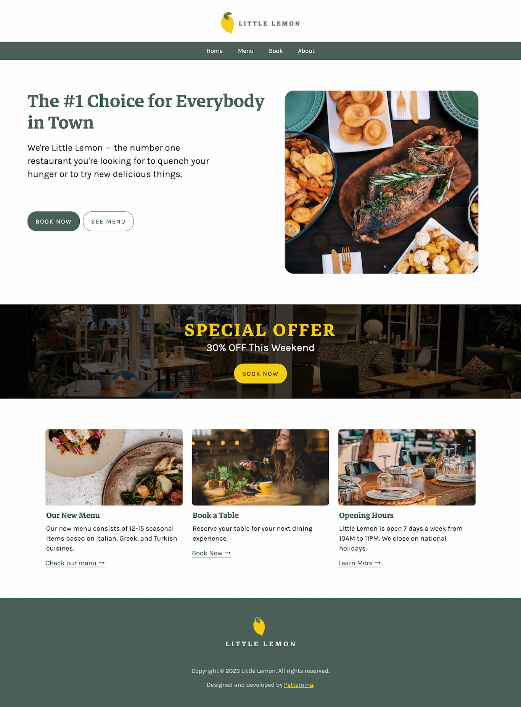
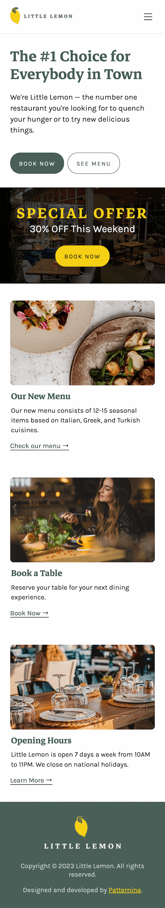
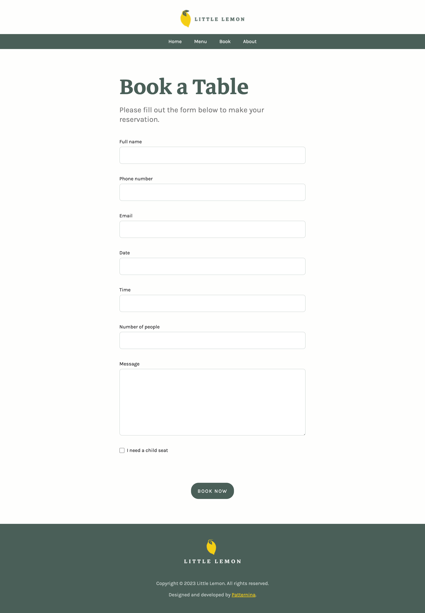
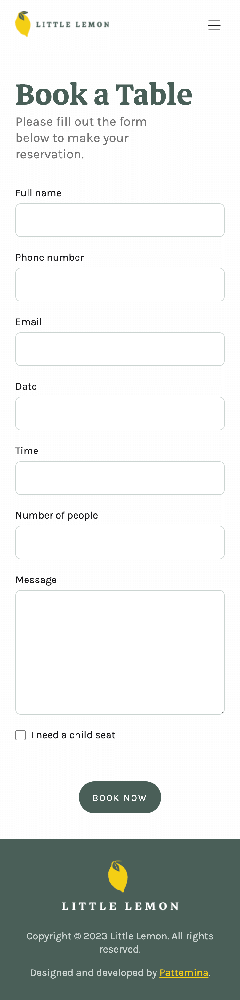
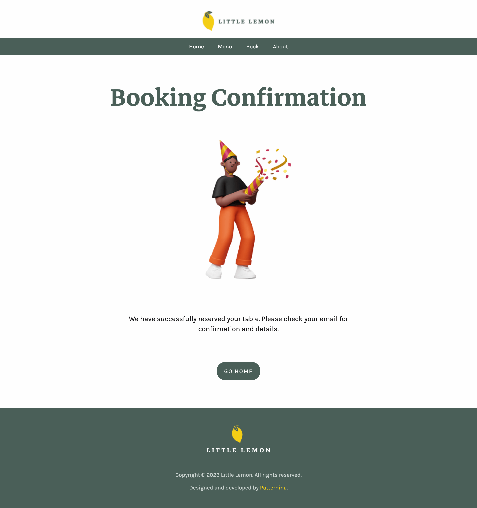
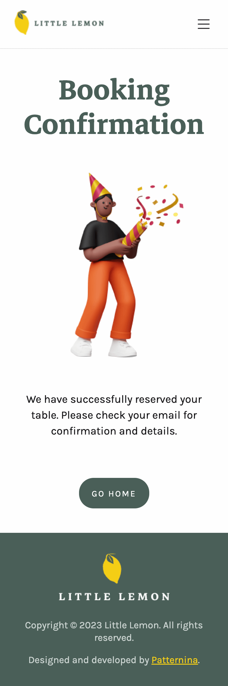
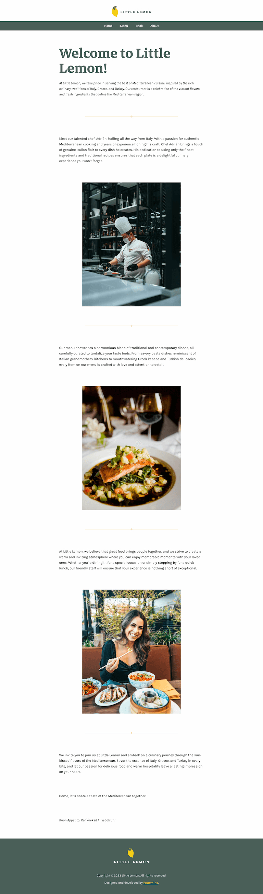
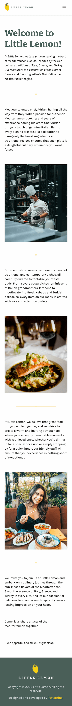

# Little Lemon's Website

This is the main website for the Little Lemon project. It's a website made with the Django framework. This project is part of the [Meta Back-End Developer Professional Certificate](https://www.coursera.org/professional-certificates/meta-back-end-developer).

## Screenshots

### Home Page

### Booking Page

### Booking Confirmation Page

### About Page

## Project/Folder Structure

- `website/` - The main Django project.
- `website/restaurant` - The main Django application.

## Requirements

- Python 3.8
- Django 3.1.7

## Installation

1. Clone this repository.
2. Install the requirements with `pip install -r requirements.txt`.
3. Run the server with `python manage.py runserver`.

## Usage

1. Go to `http://localhost:8000/` in your browser.
